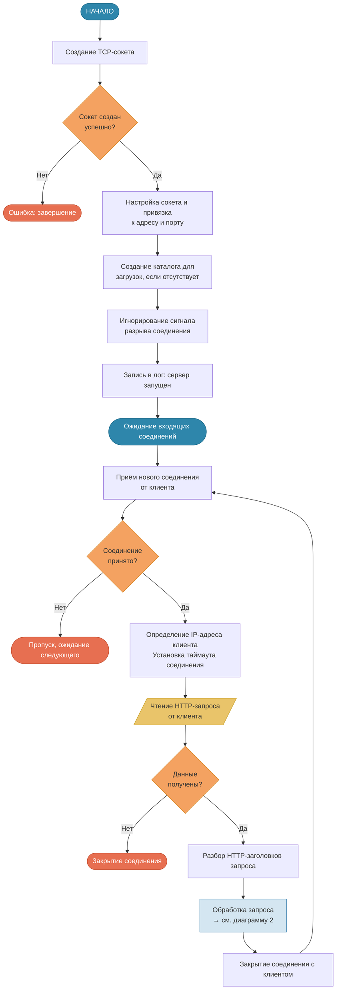

# Рисунок 1 — Главный цикл сервера (start_server)

```mermaid
flowchart TD
    START([НАЧАЛО])
    N1["Создание TCP-сокета"]
    D1{Сокет создан\nуспешно?}
    E1([Ошибка: завершение])
    N2["Настройка сокета и привязка\nк адресу и порту"]
    N3["Создание каталога для\nзагрузок, если отсутствует"]
    N4["Игнорирование сигнала\nразрыва соединения"]
    N5["Запись в лог: сервер запущен"]
    LOOP(["Ожидание входящих соединений"])
    N6["Приём нового соединения\nот клиента"]
    D2{Соединение\nпринято?}
    E2(["Пропуск, ожидание следующего"])
    N7["Определение IP-адреса клиента\nУстановка таймаута соединения"]
    N8[/"Чтение HTTP-запроса\nот клиента"/]
    D3{Данные\nполучены?}
    E3(["Закрытие соединения"])
    N9["Разбор HTTP-заголовков запроса"]
    N10["Обработка запроса\n→ см. диаграмму 2"]
    N11["Закрытие соединения с клиентом"]

    START --> N1 --> D1
    D1 -- Нет --> E1
    D1 -- Да --> N2 --> N3 --> N4 --> N5 --> LOOP --> N6 --> D2
    D2 -- Нет --> E2
    D2 -- Да --> N7 --> N8 --> D3
    D3 -- Нет --> E3
    D3 -- Да --> N9 --> N10 --> N11 --> N6

    style START fill:#2E86AB,color:#fff,stroke:#1B6A8A
    style E1 fill:#E76F51,color:#fff,stroke:#C54E2F
    style E2 fill:#E76F51,color:#fff,stroke:#C54E2F
    style E3 fill:#E76F51,color:#fff,stroke:#C54E2F
    style LOOP fill:#2E86AB,color:#fff,stroke:#1B6A8A
    style N8 fill:#E9C46A,stroke:#C49B1C
    style N10 fill:#D4E6F1,stroke:#2874A6
    style D1 fill:#F4A261,stroke:#D4831E
    style D2 fill:#F4A261,stroke:#D4831E
    style D3 fill:#F4A261,stroke:#D4831E
```
