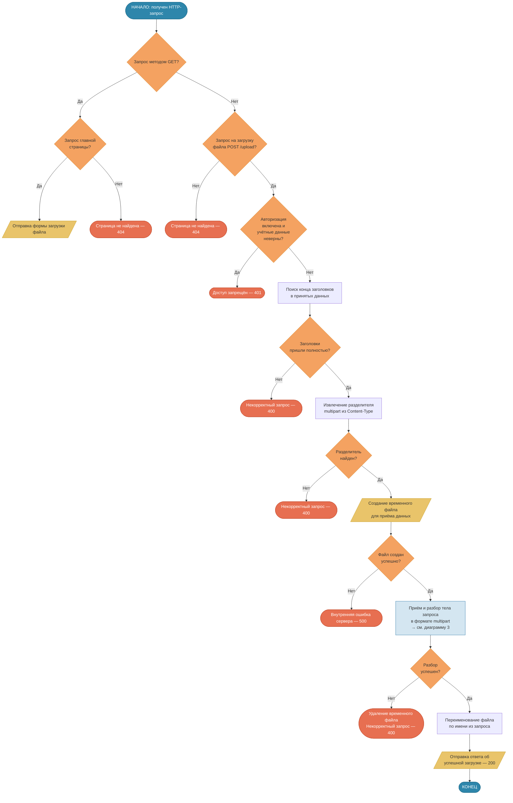

# Рисунок 2 — Маршрутизация и обработка HTTP-запроса

```mermaid
flowchart TD
    START([НАЧАЛО: получен HTTP-запрос])
    D1{Запрос методом GET?}

    D_GET{Запрос главной\nстраницы?}
    E_FORM[/"Отправка формы загрузки файла"/]
    E_404A(["Страница не найдена — 404"])

    D2{Запрос на загрузку\nфайла POST /upload?}
    E_404B(["Страница не найдена — 404"])

    D3{Авторизация\nвключена и\nучётные данные\nневерны?}
    E_401(["Доступ запрещён — 401"])

    N1["Поиск конца заголовков\nв принятых данных"]
    D4{Заголовки\nпришли полностью?}
    E_400A(["Некорректный запрос — 400"])

    N2["Извлечение разделителя\nmultipart из Content-Type"]
    D5{Разделитель\nнайден?}
    E_400B(["Некорректный запрос — 400"])

    N3[/"Создание временного файла\nдля приёма данных"/]
    D6{Файл создан\nуспешно?}
    E_500(["Внутренняя ошибка сервера — 500"])

    N4["Приём и разбор тела запроса\nв формате multipart\n→ см. диаграмму 3"]
    D7{Разбор\nуспешен?}
    E_400C(["Удаление временного файла\nНекорректный запрос — 400"])

    N5["Переименование файла\nпо имени из запроса"]
    N6[/"Отправка ответа об\nуспешной загрузке — 200"/]
    END([КОНЕЦ])

    START --> D1
    D1 -- Да --> D_GET
    D1 -- Нет --> D2
    D_GET -- Да --> E_FORM
    D_GET -- Нет --> E_404A
    D2 -- Нет --> E_404B
    D2 -- Да --> D3
    D3 -- Да --> E_401
    D3 -- Нет --> N1 --> D4
    D4 -- Нет --> E_400A
    D4 -- Да --> N2 --> D5
    D5 -- Нет --> E_400B
    D5 -- Да --> N3 --> D6
    D6 -- Нет --> E_500
    D6 -- Да --> N4 --> D7
    D7 -- Нет --> E_400C
    D7 -- Да --> N5 --> N6 --> END

    style START fill:#2E86AB,color:#fff,stroke:#1B6A8A
    style END fill:#2E86AB,color:#fff,stroke:#1B6A8A
    style E_404A fill:#E76F51,color:#fff,stroke:#C54E2F
    style E_404B fill:#E76F51,color:#fff,stroke:#C54E2F
    style E_401  fill:#E76F51,color:#fff,stroke:#C54E2F
    style E_400A fill:#E76F51,color:#fff,stroke:#C54E2F
    style E_400B fill:#E76F51,color:#fff,stroke:#C54E2F
    style E_400C fill:#E76F51,color:#fff,stroke:#C54E2F
    style E_500  fill:#E76F51,color:#fff,stroke:#C54E2F
    style E_FORM fill:#E9C46A,stroke:#C49B1C
    style N3     fill:#E9C46A,stroke:#C49B1C
    style N6     fill:#E9C46A,stroke:#C49B1C
    style N4     fill:#D4E6F1,stroke:#2874A6
    style D1 fill:#F4A261,stroke:#D4831E
    style D2 fill:#F4A261,stroke:#D4831E
    style D3 fill:#F4A261,stroke:#D4831E
    style D4 fill:#F4A261,stroke:#D4831E
    style D5 fill:#F4A261,stroke:#D4831E
    style D6 fill:#F4A261,stroke:#D4831E
    style D7 fill:#F4A261,stroke:#D4831E
    style D_GET fill:#F4A261,stroke:#D4831E
```
