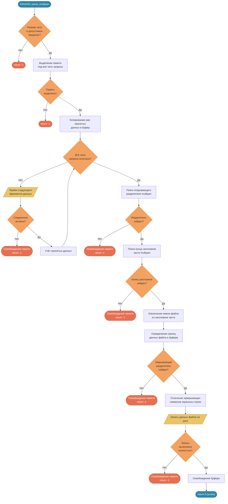

# Рисунок 3 — Алгоритм parse_multipart()

```mermaid
flowchart TD
    START([НАЧАЛО: parse_multipart])

    D1{Размер тела\nв допустимых\nпределах?}
    E1(["return -1"])

    N1["Выделение памяти\nпод всё тело запроса"]
    D_MALLOC{Память\nвыделена?}
    E2(["return -1"])

    N2["Копирование уже принятых\nданных в буфер"]

    LOOP_START{Всё тело\nзапроса получено?}
    N3[/"Приём следующего\nфрагмента данных"/]
    D2{Соединение\nактивно?}
    E3(["Освобождение памяти\nreturn -1"])
    N3B["Учёт принятых данных"]

    N4["Поиск открывающего\nразделителя multipart"]
    D3{Разделитель\nнайден?}
    E4(["Освобождение памяти\nreturn -1"])

    N5["Поиск конца заголовков\nчасти multipart"]
    D4{Конец заголовков\nнайден?}
    E5(["Освобождение памяти\nreturn -1"])

    N6["Извлечение имени файла\nиз заголовков части"]

    N7["Определение границ\nданных файла в буфере"]
    D5{Закрывающий\nразделитель\nнайден?}
    E6(["Освобождение памяти\nreturn -1"])

    N8["Отсечение завершающих\nсимволов переноса строки"]

    N9[/"Запись данных файла на диск"/]
    D6{Запись\nвыполнена\nполностью?}
    E7(["Освобождение памяти\nreturn -1"])

    N10["Освобождение буфера"]
    END(["return 0 (успех)"])

    START --> D1
    D1 -- Нет --> E1
    D1 -- Да --> N1 --> D_MALLOC
    D_MALLOC -- Нет --> E2
    D_MALLOC -- Да --> N2 --> LOOP_START
    LOOP_START -- Нет --> N3 --> D2
    D2 -- Нет --> E3
    D2 -- Да --> N3B --> LOOP_START
    LOOP_START -- Да --> N4 --> D3
    D3 -- Нет --> E4
    D3 -- Да --> N5 --> D4
    D4 -- Нет --> E5
    D4 -- Да --> N6 --> N7 --> D5
    D5 -- Нет --> E6
    D5 -- Да --> N8 --> N9 --> D6
    D6 -- Нет --> E7
    D6 -- Да --> N10 --> END

    style START fill:#2E86AB,color:#fff,stroke:#1B6A8A
    style END   fill:#2E86AB,color:#fff,stroke:#1B6A8A
    style E1 fill:#E76F51,color:#fff,stroke:#C54E2F
    style E2 fill:#E76F51,color:#fff,stroke:#C54E2F
    style E3 fill:#E76F51,color:#fff,stroke:#C54E2F
    style E4 fill:#E76F51,color:#fff,stroke:#C54E2F
    style E5 fill:#E76F51,color:#fff,stroke:#C54E2F
    style E6 fill:#E76F51,color:#fff,stroke:#C54E2F
    style E7 fill:#E76F51,color:#fff,stroke:#C54E2F
    style N3 fill:#E9C46A,stroke:#C49B1C
    style N9 fill:#E9C46A,stroke:#C49B1C
    style D1 fill:#F4A261,stroke:#D4831E
    style D2 fill:#F4A261,stroke:#D4831E
    style D3 fill:#F4A261,stroke:#D4831E
    style D4 fill:#F4A261,stroke:#D4831E
    style D5 fill:#F4A261,stroke:#D4831E
    style D6 fill:#F4A261,stroke:#D4831E
    style D_MALLOC fill:#F4A261,stroke:#D4831E
    style LOOP_START fill:#F4A261,stroke:#D4831E
```
