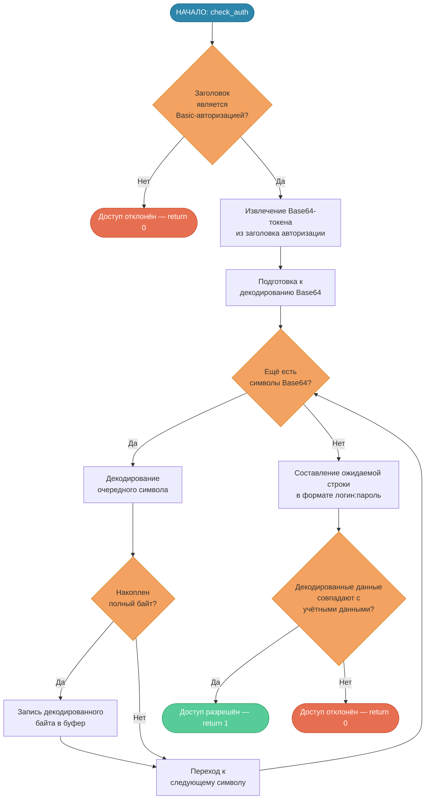

# Рисунок 4 — Алгоритм check_auth() и декодирования Base64

```mermaid
flowchart TD
    START([НАЧАЛО: check_auth])

    D1{Заголовок\nявляется\nBasic-авторизацией?}
    E1(["Доступ отклонён — return 0"])

    N1["Извлечение Base64-токена\nиз заголовка авторизации"]

    N2["Подготовка к\nдекодированию Base64"]

    LOOP{Ещё есть\nсимволы Base64?}
    N3["Декодирование\nочередного символа"]
    D2{Накоплен\nполный байт?}
    N4["Запись декодированного\nбайта в буфер"]
    N5["Переход к\nследующему символу"]

    N6["Составление ожидаемой строки\nв формате логин:пароль"]

    D3{Декодированные данные\nсовпадают с\nучётными данными?}
    E2(["Доступ разрешён — return 1"])
    E3(["Доступ отклонён — return 0"])

    START --> D1
    D1 -- Нет --> E1
    D1 -- Да --> N1 --> N2 --> LOOP
    LOOP -- Да --> N3 --> D2
    D2 -- Да --> N4 --> N5 --> LOOP
    D2 -- Нет --> N5
    LOOP -- Нет --> N6 --> D3
    D3 -- Да --> E2
    D3 -- Нет --> E3

    style START fill:#2E86AB,color:#fff,stroke:#1B6A8A
    style E1 fill:#E76F51,color:#fff,stroke:#C54E2F
    style E2 fill:#57CC99,color:#fff,stroke:#38A169
    style E3 fill:#E76F51,color:#fff,stroke:#C54E2F
    style D1 fill:#F4A261,stroke:#D4831E
    style D2 fill:#F4A261,stroke:#D4831E
    style D3 fill:#F4A261,stroke:#D4831E
    style LOOP fill:#F4A261,stroke:#D4831E
```
