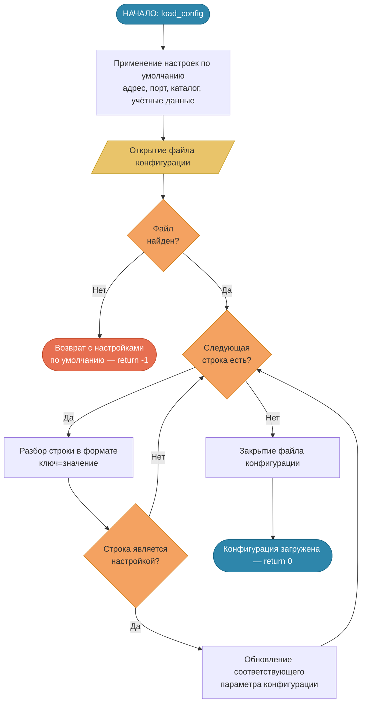

# Рисунок 5 — Алгоритм загрузки конфигурации (load_config)

```mermaid
flowchart TD
    START([НАЧАЛО: load_config])

    N1["Применение настроек по умолчанию\nадрес, порт, каталог, учётные данные"]

    N2[/"Открытие файла конфигурации"/]
    D1{Файл\nнайден?}
    E1(["Возврат с настройками\nпо умолчанию — return -1"])

    LOOP{Следующая\nстрока есть?}

    N3["Разбор строки в формате\nключ=значение"]
    D2{Строка является\nнастройкой?}

    N4["Обновление соответствующего\nпараметра конфигурации"]

    N5["Закрытие файла конфигурации"]
    END(["Конфигурация загружена — return 0"])

    START --> N1 --> N2 --> D1
    D1 -- Нет --> E1
    D1 -- Да --> LOOP
    LOOP -- Да --> N3 --> D2
    D2 -- Нет --> LOOP
    D2 -- Да --> N4 --> LOOP
    LOOP -- Нет --> N5 --> END

    style START fill:#2E86AB,color:#fff,stroke:#1B6A8A
    style END   fill:#2E86AB,color:#fff,stroke:#1B6A8A
    style E1    fill:#E76F51,color:#fff,stroke:#C54E2F
    style N2    fill:#E9C46A,stroke:#C49B1C
    style D1    fill:#F4A261,stroke:#D4831E
    style D2    fill:#F4A261,stroke:#D4831E
    style LOOP  fill:#F4A261,stroke:#D4831E
```
