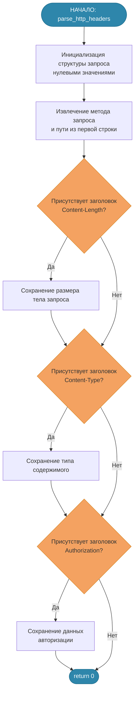

# Рисунок 6 — Алгоритм парсинга HTTP-заголовков (parse_http_headers)

```mermaid
flowchart TD
    START([НАЧАЛО: parse_http_headers])

    N1["Инициализация структуры запроса\nнулевыми значениями"]
    N2["Извлечение метода запроса\nи пути из первой строки"]

    D1{Присутствует заголовок\nContent-Length?}
    N3["Сохранение размера тела запроса"]

    D2{Присутствует заголовок\nContent-Type?}
    N4["Сохранение типа содержимого"]

    D3{Присутствует заголовок\nAuthorization?}
    N5["Сохранение данных\nавторизации"]

    END(["return 0"])

    START --> N1 --> N2 --> D1
    D1 -- Да --> N3 --> D2
    D1 -- Нет --> D2
    D2 -- Да --> N4 --> D3
    D2 -- Нет --> D3
    D3 -- Да --> N5 --> END
    D3 -- Нет --> END

    style START fill:#2E86AB,color:#fff,stroke:#1B6A8A
    style END   fill:#2E86AB,color:#fff,stroke:#1B6A8A
    style D1 fill:#F4A261,stroke:#D4831E
    style D2 fill:#F4A261,stroke:#D4831E
    style D3 fill:#F4A261,stroke:#D4831E
```
